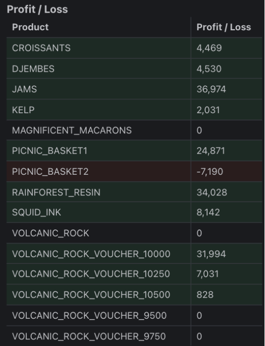
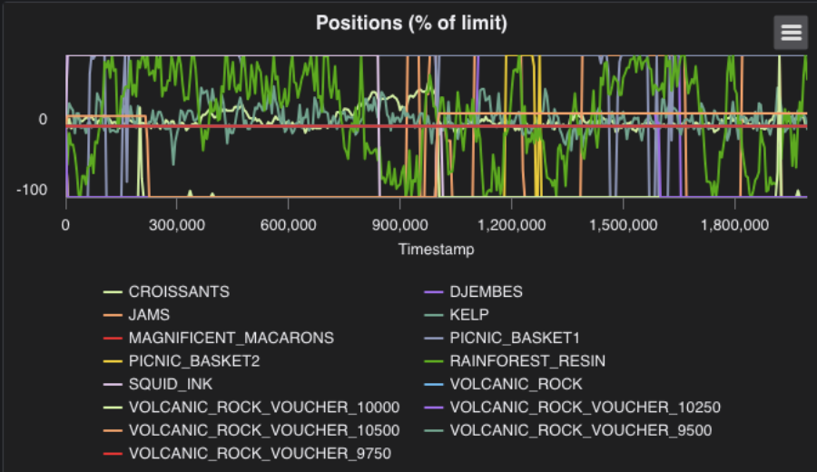

# Trader Joe's report - IMC Prosperity 3

Conor Grant, Aaro Parkkinen, Hamish Poole

IMC Prosperity 3 was a global 15-day algorithmic trading competition
held from April 7th to 22nd, 2025. Spanning five distinct rounds - each
lasting three days - the competition involved intense algorithmic
trading challenges and manual trading tasks. The competition required
strong coding skills, mathematical intuition, and the ability to make
data-driven decisions under time pressure.

Each round comprised two parts: an algorithmic challenge and a manual
trading problem. The algorithmic component was cumulative, with each
round introducing new products or market information. This increased the
complexity of the challenge while adding to the trading opportunities to
maximize potential profits. After each round, submitted algorithms were
evaluated in a simulated marketplace.

We finished globally in the top 4% of teams - 462nd out of the 12,621
total participating teams.

- 462nd Globally

- 4th in Ireland

- 736th in algorithmic trading

- 318th in manual trading

## Team introduction

Conor and Aaro are final-year Financial Mathematics students from
University College Dublin. Our team also included Hamish, a software
engineer from Sydney, Australia, whom we connected with through the IMC
Prosperity Discord. This report is written from the perspective of Conor
and Aaro (we), also acknowledging the strong participation and valuable
efforts from our teammate Hamish.

## Why we took part in IMC Prosperity 3

We are both passionate about investments and trading, actively 
follow the financial markets and continuously try to learn more about 
investing - both of us have been actively investing since turning 18.
Our academic background in Financial Mathematics as well as Aaro having completed 
an internship in trading, gave us a solid technical foundation going into the 
competition. A driver for us to join the competition was the chance to on expand 
our computational expertise, challenge ourselves and prove our capabilities.

## Thoughts and learning outcomes

Starting this challenge, we had a strong mathematical foundation and an
intermediate-level of coding knowledge. In Python, we were comfortable
creating basic programs to solve problems in computational finance. 
We also had knowledge about data analysis and visualization in Python.

However, the challenge forced us to adapt and learn new skills quickly.
IMC Prosperity used object-oriented programming (OOP) in Python, with
which we were not familiar. Over the two weeks, we learned a significant
amount of new coding concepts, key techniques to write new code and
methods of de-bugging. We began testing the efficiency of our code and
added visualizers and a back-testing tool into our process to create and
evaluate new strategies.

We also adopted Github as our primary collaboration tool, which was
crucial for maintaining clear communication across time zones and
keeping track of each team member's progress and findings. By the end of
the competition, our code had become well-organized, modular, and easy
to read and modify. From round three onwards, we implemented
back-testing and visualisation to analyse our trading accelerating our
process from data analysis to writing code and determining its
performance.

## Algorithmic Rounds

The algorithmic trading challenge ran continuously over the 15-day
competition, with each round introducing new products or market
information. This progressively increased the opportunities for profit
while adding to the complexity and total workload. All the algorithms
centred around object-oriented programming requiring us to familiarise a
new way of coding and its rationale. In the first round, we spent
significant time trying to understand the provided codebase just to even
get a single trade to execute. Collaborating with Hamish helped ease the
initial coding burden, allowing us to focus more on developing trading
strategies and analysing given data rather than the execution of python
code.

We quickly learned that analysing historical data-extracting and
visualizing key metrics-was extremely time-consuming. We had multiple
sessions of analysis and coming up with ideas only to apply these into a
code that turned out the be a dead-end. Being efficient with
back-testing turned out to be one of the core competencies in this
challenge require to succeed in the given timeframe.

Overall, we learned a tremendous amount about coding and adopted several
good habits that will serve us well in future projects. Sharing and
organising our work efficiently became essential. By round 3, we were
all working on the same codebase, improving our collaboration and made
it easier to share our findings and fails through GitHub.
### Trading strategies

#### Rainforest Resin

This product was an actively traded commodity worth 10,000 SeaShells,
typically traded around 0.1 % of its true price. We implemented a
market-making strategy to sell above and buy below the 10,000 level,
profiting from the bid-ask spread.

#### Kelp & Croissants

For these products, we also applied a market-making strategy. Since
these products didn't have a 'true price', the market making was
adjusting continuously to the order book imbalances, and dynamically
changing quoting behaviour depending on current position. We were
experimenting with different momentum-based strategies and Bollinger
bands, however, both products were relatively stable, and we unable to
find a consistently profitable strategy outside market-making.

#### Squid Ink

This product was the most time-consuming throughout the challenge.
Initially, we pursued a momentum-based strategy, to capture profits from
its large price swings. After those proved unstable, our focus drifted
towards short-to-medium term mean reversion approach. Despite extensive
modelling trying to quantify the key metrics to make this strategy work
we did not achieve a fully functional stable strategy.

#### Jams & Djembes

These products had low Average Ture Range (ATR) values, moving
marginally daily. We utilized floor/ceiling prices to try to trade
relative price ranges, which proved to outperform momentum and market
making strategies, and eventually developed slightly profitable stable
strategies to trade these products.

#### Picnic Baskets

The two Picnic Baskets functioned as ETFs consisting of a mix of the
three previously mentioned products: Jams, Djembes and Croissants. Our
strategies for both baskets focused on identifying price discrepancies
between baskets and sum of their components. We used principles of
arbitrage to buy when baskets were undervalued and sell overvalued.
These strategies worked reliably and created a constant income source
for us.

#### Volcanic Rock

Volcanic Rock was a highly volatile asset with large moves and the
ability to trade in large volume, offering massive trading potential. We
initially implemented a momentum-based strategy, which became one of our
best performing strategies. However, we then realised our mistake of
overfitting and the strategy turned out to be quite unstable as market
conditions changed. In our final submission, we ran into a last minute
issue with our code that resulted in no trades being executed for
Volcanic Rock for that round.

#### Vouchers

The Vouchers functioned as European-styled call options on Volcanic Rock
with different strike prices. We calculated time to expiry and realised
volatility using recent price history and applied the Black-Scholes
model to determine the fair value of each option. Our approach was
arbitrage-based trying to buy undervalued and sell overvalued options,
which worked quite well on options out-of-the-money where the moneyness
of options were at a reasonable level and mispricing occurred more
frequently. By round 5, due to time constraints, we were unable to add a
tracker for the price of Volcanic Rock, to determine which options to
trade and which were deep in the money making our algorithm
non-functional. As a result, we removed the 9500 and 9750 strike options
from our active strategy for simplicity and to reduce risk of a massive
loss.
\

#### Example day on of our final code

As mentioned above, coding was not our strongest point going into this
challenge, but after completing the 5 rounds, we can confidently say our
coding abilities drastically improved. Our ability to adapt to a
specific codebase and create functional algorithms was a standout for
us. Getting used to the object-oriented programming was initially
challenges but taught us a lot of new concepts improving our programming
ability. Using Github became a must for collaboration and sharing work
which we adopted well. At first, our collaboration with Hamish relied on
paste-bin or email, as we didn't understand the benefit of Github. As we
started using version control, both saved time and allowed us to build
on each other's progress. Particularly trading Volcanic Rock taught us
some of the most valuable lessons: the importance of back-testing
methods and visualizers, avoid overfitting, managing risk in volatile
environments, and remaining adaptable during changing conditions.

## Manual Rounds

The manual rounds consisted of solving trading challenges based on
round-specific information. The questions consisted of optimisation,
game theory, manipulating probability distributions and interpreting how
news and information could affect asset prices. Every round tested our
intuition, strategic decision-making and application of computational
and mathematical tools to evaluate different scenarios.

#### Round 1 - Currency Arbitrage

|                 | Snowballs | Pizza | Silicon Nuggets | SeaShells |
|-----------------|-----------|-------|-----------------|-----------|
| Snowballs       | 1         | 1.45  | 0.52            | 0.72      |
| Pizza           | 0.7       | 1     | 0.31            | 0.48      |
| Silicon Nuggets | 1.95      | 3.1   | 1               | 1.49      |
| SeaShells       | 1.34      | 1.98  | 0.64            | 1         |

We were given 40,000 SeaShells; the base currency of the challenge and
we were given the opportunity to trade three foreign currencies making
up to 5 total trades. To solve this, we simulated all possible trade
sequencies and picked the most profitable one: SeaShells -\> Snowballs
-\> Silicon Nuggets -\> Pizza -\> Snowballs -\> SeaShells. This was a
simple currency arbitrage problem.

#### Rounds 2 - Containers

This round involved picking one or two containers out of ten options.
Each container had a base reward of 10,000 SeaShells, multiplied by its
specific multiplier and number of base inhabitants picking that
container. The reward of each container is split between the base
inhabitants and percentage of teams selecting that container.

We performed a sensitivity analysis for the containers, looking at the
possible scenarios and other teams approaches to this problem. Our
hypothesis was that most teams would be risk-averse favouring containers
with large multipliers that were less sensitive to overallocation. Due
to our hypothesis, we leaned towards looking at the lower multiplier
containers. The 10x container being the least sensitive seemed too risky
due to it being objectively the worst pick out of all the containers,
possibly drawing more attention to it. Hence, we looked evenly at
containers 20, 31 and 37, which we believed would perform the best.

<table>
<colgroup>
<col style="width: 20%" />
<col style="width: 19%" />
<col style="width: 19%" />
<col style="width: 19%" />
<col style="width: 20%" />
</colgroup>
<thead>
<tr class="header">
<th>
10x – 1 inhabitant

0.998% players
</th>
<th>
17x – 1 inhabitant

7.539% players
</th>
<th>
20x – 2 inhabitants

1.614% players
</th>
<th>
31x – 2 inhabitants

6.987% players
</th>
<th>
37x – 3 inhabitants

5.118% players
</th>
</tr>
</thead>
<tbody>
<tr class="odd">
<td>
50x – 4 inhabitants

8.516% players
</td>
<td>
73x- 4 inhabitants

24.060% players
</td>
<td>
80x – 6 inhabitants

18.178% players
</td>
<td>
89x – 8 inhabitants

15.184% players
</td>
<td>
90x – 10 inhabitants

11.807% players
</td>
</tr>
</tbody>
</table>

Ultimately, we decided to choose 31, which unfortunately ended up being
the worst out of our final three picks, returning a payoff of
approximately 34,000 SeaShells. We chose not to select a second
container due to the high additional fee (50,000) as our expected profit
would be negative, expecting that at most two containers would yield
this profit making this too risky.

#### Round 3 - Auction

This round, we had the chance to trade flippers with Sea Turtles by
submitting two bids. The problem combined game theory and optimisation.
The Sea Turtles would accept the lowest bid exceeding their reserve
price, which was uniformly distributed within two ranges; 160-200 and
250-320. After the auction, the flippers could be sold again at a fixed
price of 320. The first pick was purely optimised by finding the highest
expected return, turning out to be 200. For the second bid, the average
of every team's second bid affected the overall decision, profits made
below the average were reduced by a factor:

\$p = \left( \frac{320 - \text{average bid}}{320 - \text{your bid}}
\right)\^3\$

Being below the average bid turned out to be significantly more costly
than bidding slightly above it. From purely optimising the second bid,
285 gave the highest return and we ultimately submitted 297 as our
second pick. Most teams were bidding very close to the 'optimal'
solution, showing low risk-aversion and average bid turned out to be
287, which resulted in a slight loss for us compared to the overall
field.

#### Round 4 - Containers 2.0

This round was an extension of round 2, but with 20 containers. This
time there was the option to choose one container for free, second one
for 50,000 and third for 100,000 Seashells. The increased number of
options changed the dynamics, reducing the likelihood of any single
container would receive over 8-10% of the total picks. All participants
were reminded of how well the low multiplier containers did in round 2
creating a shift in mindset within participants. Our sensitivity
analysis clearly directed us toward higher-multiplier containers. Our
rationale was that every team would also do the analysis and go for safe
profits like in round 2. This turned out to be the wrong hypothesis and
the big profits created by the lower-multiplier containers in round 2
shifted the overall mindset of participants, making the high multiplier
containers the most profitable. We chose two lower-multiplier containers, 
and once again received an average payoff from this challenge. Our rationale 
to picking two was that most containers would return above 50,000 SeaShells, 
however, the 100,000 fee to choose a third was too risky.

#### Round 5 - News based market prediction

In the final round, we were given brief news articles for different
products and had to predict price movements before market opening. We
could trade ahead of the market at a significant fee per product.

| Product        | Predicted move | Actual move | Fee     | Profit & Loss |
|----------------|----------------|-------------|---------|---------------|
| Haystacks      | 1%             | -0.48%      | 120     | -168          |
| Ranch sauce    | 5%             | -0.72%      | 3,000   | -3,361        |
| Cacti Needle   | -32%           | -41.2%      | 122,880 | 9,105         |
| Solar panels   | -11%           | -8.9%       | 14,520  | -4,638        |
| Red flags      | 8%             | 50.9%       | 7,680   | 33,046        |
| VR monocle     | 13%            | 22.4%       | 20,280  | 8,876         |
| Quantum coffee | -16%           | -66.79%     | 30,720  | 76,153        |
| Moonshine      | \-             | 3%          | \-      | \-            |
| Striped shirts | \-             | 0.21%       | \-      | \-            |
| Total          |                |             | 199,200 | 119,013       |

Our analysis which attempted to predict the moves was quite strong. We
missed out on significant gains on Red Flags, not quite pricing in the
scarcity described in the news article for a high demand asset leading
to this large increase in price. This round our overall persistence and
intuition led to one of our best performances.

The manual trading was a strong aspect for us going into the competition
supported by our extensive backgrounds in mathematics. 
Throughout the challenge, we learned to understanding other
market participants and their behaviour in financial environments. We
learned to evaluating risk tolerance and use stress-testing and
simulations outside an academic environment sharpening our strategic
thinking and decision-making under uncertainty. One of the key lessons
was the importance of maintaining an objective perspective under
uncertainty - recognizing that others may react irrationally to change
or new information. While understanding game theory is essential, the
edge lies in identifying and exploiting the mistakes of others. This
competition reinforced that success in trading often comes not just from
having a strong strategy, but from adapting to dynamic and unpredictable
conditions.

## Conclusions

This competition was an excellent learning experience in algorithmic
trading. Starting from limited programming knowledge, we progressed to
developing and refining complex trading strategies. We learned to apply
technical skills to the overall trading process - from market and data
analysis to strategic execution and performance evaluation. It is always
exciting to compete with other like-minded individuals while learning
about trading and developing real-world skills. Not everything we did 
was successful, but every success and every failure offered opportunities 
for growth. This experience has inspired us to continue learning about 
trading and elevate our coding ability to the new level.

We want to thank our teammate Hamish for bringing valuable experience
and a positive mindset to our team. His contributions helped keep the
team on track and our overseas collaboration was a success - greatly
enhancing our overall experience in the competition. We also want to
thank IMC Trading for organising this challenge. It gave us valuable
experience and new fresh insights on what skills are important for
success in trading and in the financial markets.
